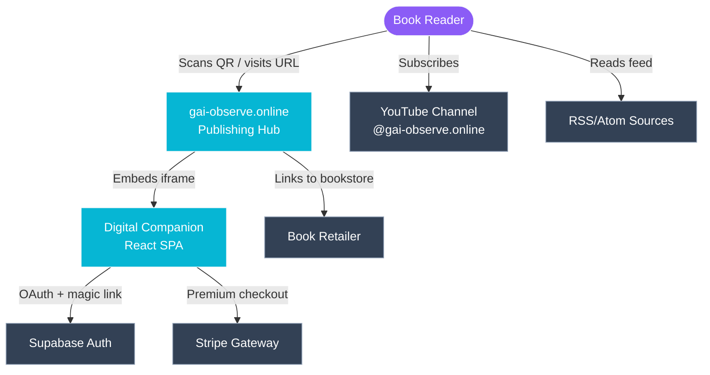
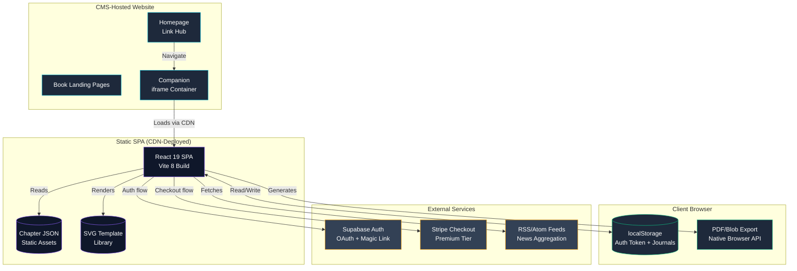
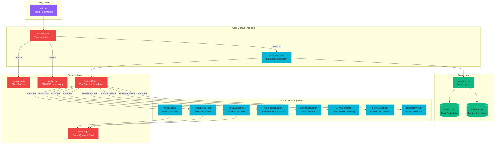
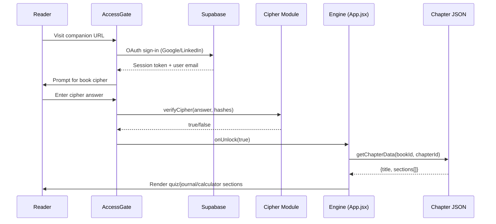
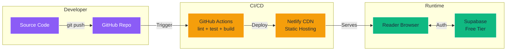

# System Architecture
**System:** gai-observe.online Digital Companion
**Standard:** C4-Inspired Architectural Modeling (L1 Context, L2 Container, L3 Component)
**Last Updated:** 2026-05

---

## Level 1: System Context

Maps high-level interactions between external actors, the primary system, and third-party dependencies.

### L1 Decisions
- **Single system boundary** encompasses both the CMS-hosted website and the SPA companion
- **Supabase** chosen for auth because of generous free tier (50K MAU) and built-in OAuth providers
- **No custom backend** — eliminates server maintenance, hosting costs, and attack surface

---

## Level 2: Container Diagram

Zooms into the system boundary to show deployment containers, data stores, and communication patterns.

### L2 Decisions
- **iframe embedding** isolates companion code from CMS context (security boundary)
- **Static JSON** instead of API — zero latency, zero server cost, works offline
- **localStorage** for journals/tokens — no server-side session storage needed
- **CDN deployment** via Netlify — global edge caching, automatic HTTPS

---

## Level 3: Component Diagram

Zooms into the React SPA container to detail internal modules, data flow, and responsibilities.

### L3 Component Specifications

| Component | Responsibility | State Management |
|-----------|---------------|-----------------|
| **AccessGate** | Two-step auth UI (OAuth → cipher) | Local state + Supabase session listener |
| **QuizEngine** | Multi-question assessment with scoring | Local selections + submitted flag |
| **ReflectionJournal** | Auto-saving textarea with PDF export | Debounced localStorage writes |
| **RICESandbox** | RICE priority scoring calculator | Local feature array + sort |
| **ABTestCalculator** | Statistical significance calculator | Local form state |
| **TemplateViewer** | SVG template gallery with download | Static asset references |
| **FeatureGate** | Tier-based access control | Supabase subscription query |
| **AuditLog** | Client-side event queue with batch flush | In-memory queue + localStorage fallback |

---

## Data Flow

---

## Deployment Architecture

### Infrastructure Costs

| Service | Tier | Monthly Cost |
|---------|------|-------------|
| GitHub | Free | $0 |
| GitHub Actions | Free (2,000 min/mo) | $0 |
| Netlify | Free (100GB bandwidth) | $0 |
| Supabase | Free (50K MAU) | $0 |
| **Total** | | **$0** |
