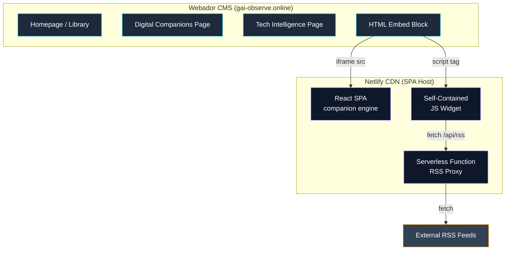

# Webador CMS Integration — Learnings & Patterns

This document captures hard-won lessons from integrating a React SPA with Webador, a WYSIWYG website builder. These patterns are generalizable to any CMS-hosted + SPA-embedded architecture.

---

## Architecture: CMS + SPA Hybrid



### The Core Pattern

Webador provides the CMS shell (navigation, SEO, landing pages, book catalog). Complex interactive features live in a separately deployed React SPA, embedded via Webador's HTML Embed blocks. This separation gives us:

1. **CMS for content, SPA for interaction** — Non-technical content updates stay in Webador; code changes deploy independently via CI/CD
2. **Independent deployment** — SPA updates don't require CMS republish
3. **Security isolation** — iframe sandbox prevents CMS-side scripts from accessing SPA state

---

## Lesson 1: The Editor-Frame Discovery

**Problem:** Webador's page editor renders content inside a nested iframe (`#editor-frame`). Standard DOM queries from the outer editor context find nothing — the elements exist in a different document context.

**Discovery:** After adding an HTML Embed block in Webador's editor, you must:
1. Switch to the iframe context (`page.frame('#editor-frame')`)
2. Locate the embed element within that frame
3. Click it to open the editor dialog

**Impact:** All Playwright automation scripts for CMS deployment must handle this two-level iframe nesting. A click on the main page that should hit an embed block will miss entirely unless you enter the frame context first.

**Pattern:**
```
Webador Editor Page
└── #editor-frame (iframe)
    └── Page content (where embed blocks live)
        └── HTML Embed element (click to edit)
            └── Editor dialog (paste code here)
```

**Generalized lesson:** WYSIWYG builders commonly render previews in iframes. Always inspect the DOM tree for nested frames before writing automation.

---

## Lesson 2: Three Widget Embedding Strategies

We developed three approaches to embedding dynamic content in Webador, each with different tradeoffs:

### Strategy A: Full iframe

```html
<iframe
  src="https://your-spa.netlify.app/page.html"
  style="width:100%;min-height:2800px;border:none;"
  loading="eager"
  title="Widget Title"
></iframe>
```

**Pros:** Full isolation, own CSS scope, can use React/frameworks
**Cons:** Fixed height (no auto-resize without `postMessage`), separate network requests, no CMS style inheritance
**Use when:** Complex interactive tools (companion engine, dashboards)

### Strategy B: Self-Contained Widget (HTML + CSS + JS in embed block)

```html
<div id="my-widget">
  <style>
    #my-widget { /* fully scoped styles */ }
  </style>
  <script>
    (function() { /* self-contained logic */ })();
  </script>
</div>
```

**Pros:** No external dependencies, instant render, height adapts naturally
**Cons:** Must scope ALL CSS to prevent CMS style bleed, no framework support, limited complexity
**Use when:** Static content displays, styled announcement blocks

### Strategy C: Remote Script Widget

```html
<div id="intel-root"></div>
<script src="https://your-spa.netlify.app/widgets/tech-intel.js"></script>
```

**Pros:** Code lives in your repo (version controlled), CMS just loads it, can be complex
**Cons:** External dependency (CDN must be up), initial load delay, must handle CMS style conflicts
**Use when:** Medium-complexity widgets that need version control (news feeds, dynamic dashboards)

### Recommendation

| Feature Complexity | Recommended Strategy |
|-------------------|---------------------|
| Static display / announcement | Strategy B (self-contained) |
| Dynamic data / API calls | Strategy C (remote script) |
| Full application / auth flow | Strategy A (iframe) |

---

## Lesson 3: iframe Height Management

**Problem:** iframes in Webador don't auto-resize to content height. Content below the fold is clipped.

**Approaches tried:**

| Approach | Outcome |
|----------|---------|
| Fixed `min-height: 2800px` | Works but wastes space on short content |
| `postMessage` height sync | Best UX but requires script on both sides |
| `ResizeObserver` in parent | Blocked by same-origin policy |

**Working solution:** Set a generous `min-height` on the iframe and use `postMessage` for refinement:

```javascript
// Inside the iframe (SPA side)
function reportHeight() {
  const height = document.documentElement.scrollHeight;
  window.parent.postMessage({ type: 'gai-resize', height }, '*');
}

// In the CMS embed block
window.addEventListener('message', function(e) {
  if (e.data?.type === 'gai-resize') {
    document.querySelector('iframe').style.height = e.data.height + 'px';
  }
});
```

**Caveat:** `postMessage` origin should be validated in production. Using `*` is acceptable here since the message only adjusts height (not a security-sensitive action), but validate if you're passing data.

---

## Lesson 4: RSS Feed CORS Problem

**Problem:** Browser-based JavaScript cannot fetch RSS feeds directly from publishers (Ars Technica, MIT Tech Review, etc.) because those servers don't include `Access-Control-Allow-Origin` headers.

**Solution:** A serverless RSS proxy function:

```
Widget (browser) → Netlify Function (/api/rss) → RSS Publisher
                                                    ↓
                               Parse XML → Strip HTML → Return JSON
```

The proxy:
1. Receives a `?source=mit` parameter
2. Validates against an allowlist of known feed sources
3. Fetches the RSS XML server-side (no CORS restriction)
4. Strips HTML tags from descriptions (XSS prevention)
5. Optionally enriches with AI summaries (Groq API)
6. Returns clean JSON with CORS headers

**Key design decisions:**
- Source parameter validated against a hardcoded allowlist — prevents arbitrary URL proxy (SSRF)
- HTML stripped server-side before reaching the client
- CDN cache headers (`s-maxage=1800`) reduce upstream requests
- AI enrichment is optional (graceful degradation if API key missing)

---

## Lesson 5: Design Token Alignment

**Problem:** The CMS (Webador) and the SPA (React) must look like one cohesive site despite running on different platforms.

**Solution:** A shared design token vocabulary:

```css
/* Both systems use identical values */
--bg-slate:      #0F172A;
--panel-slate:   #1E293B;
--accent-violet: #8B5CF6;
--accent-cyan:   #06B6D4;
--text-primary:  #F1F5F9;
--text-muted:    #94A3B8;
```

| Element | In Webador | In React SPA |
|---------|-----------|--------------|
| Page background | Set via Webador theme settings | `var(--bg-slate)` in CSS |
| Card panels | HTML Embed inline styles | `.panel` class |
| Buttons | Webador button component | `.btn-primary` class |
| Typography | Webador font settings | `font-family: 'Inter', system-ui` |

**Lesson:** When CMS and SPA must look unified:
1. Define tokens as a single source of truth
2. Apply them differently per platform (Webador theme config vs. CSS custom properties)
3. Test alignment by viewing them side-by-side on the same page

---

## Lesson 6: Cookie Consent in Automation

**Problem:** Webador (like most European-hosted platforms) shows a cookie consent banner on first visit. This blocks Playwright automation scripts that need to interact with page content behind the banner.

**Solution:** A multi-strategy dismissal:

```javascript
// Strategy 1: Click the decline/dismiss button
const cookieBtn = page.locator(
  '.cc-deny, .cc-dismiss, button:has-text("Decline")'
).first();
if (await cookieBtn.isVisible({ timeout: 5000 })) {
  await cookieBtn.click({ force: true });
}

// Strategy 2: Remove the banner from DOM entirely
await page.evaluate(() => {
  document.getElementById('cookie-notice-wrapper')?.remove();
  document.querySelector('.cc-window-backdrop')?.remove();
});
```

**Generalized lesson:** Cookie banners vary wildly across CMS platforms. Always implement both a "click to dismiss" and a "DOM removal" fallback for automation robustness.

---

## Lesson 7: Conversion Funnel Architecture

Webador pages are organized as a conversion funnel, with each page serving a distinct purpose:

```
Homepage (awareness)
├── Hero + CTA stack
├── Architect credibility strip
├── "How it works" 3-step visual
└── Library grid with status badges
    ↓
Digital Companions (activation)
├── Book matrix (availability table)
├── Tier comparison (Free / Pro / Enterprise)
├── Preview gallery
└── Launch CTA → iframe companion
    ↓
Tech Intelligence (retention)
├── AI-enriched news feed
├── Source filters
└── Cross-links to library
    ↓
Advisory / Speaking (monetization)
├── Service descriptions
├── Social proof
└── Intake forms
```

**Key insight:** The CMS handles top-of-funnel (awareness, trust) while the SPA handles bottom-of-funnel (activation, engagement). This maps naturally to the CMS + SPA hybrid architecture.

---

## Lesson 8: Widget Deployment Automation

Deploying widgets to a WYSIWYG CMS via Playwright automation is fragile. Key reliability patterns:

1. **Generous waits after navigation** — Webador's editor loads asynchronously; `waitForLoadState('networkidle')` alone isn't sufficient
2. **Screenshot at every step** — Debugging headless CMS automation is impossible without visual breadcrumbs
3. **Frame context switching** — Always enter `#editor-frame` before interacting with page content
4. **Force clicks** — CMS editors often have overlay elements; `{ force: true }` bypasses visibility checks
5. **Idempotent operations** — Design scripts to be re-runnable (check if embed exists before adding)

**Recommendation for production:** If updating CMS content programmatically, prefer the CMS's API (if available) over browser automation. Webador doesn't expose a public API, making Playwright the only option — but this is inherently fragile and requires maintenance as the CMS UI evolves.

---

## Summary: When to Use This Pattern

The CMS + SPA hybrid is ideal when:
- You need a professional marketing website (SEO, landing pages, navigation) without building one from scratch
- Your interactive features are too complex for the CMS's native components
- You want independent deployment pipelines for content and code
- Budget is zero-cost (both Webador and Netlify have free tiers)

It's not ideal when:
- The CMS has a robust plugin/extension system (use that instead)
- All your content is dynamic (skip the CMS, build a full SPA)
- You need server-side rendering for SEO on the interactive content
